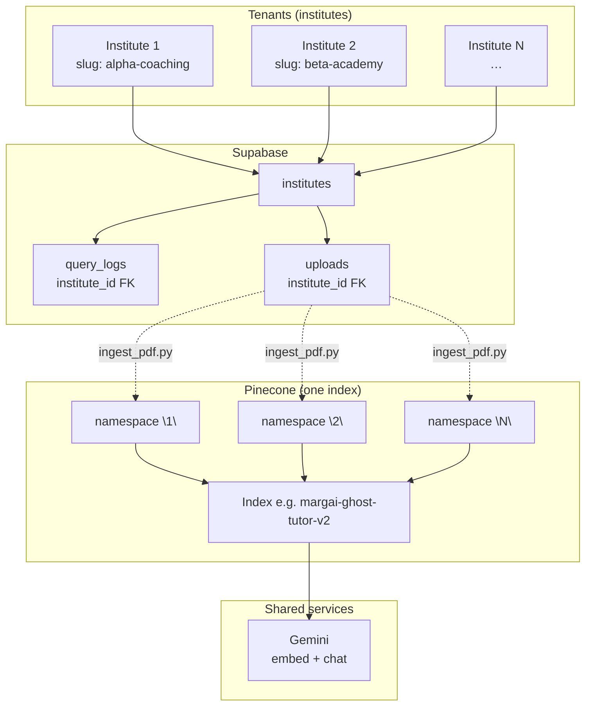
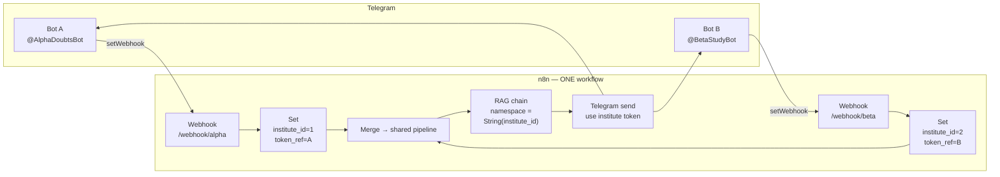
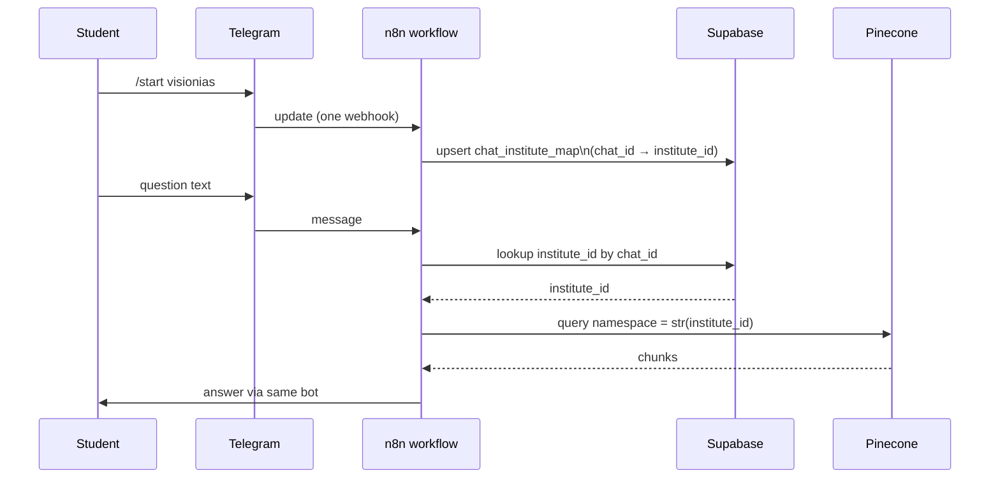
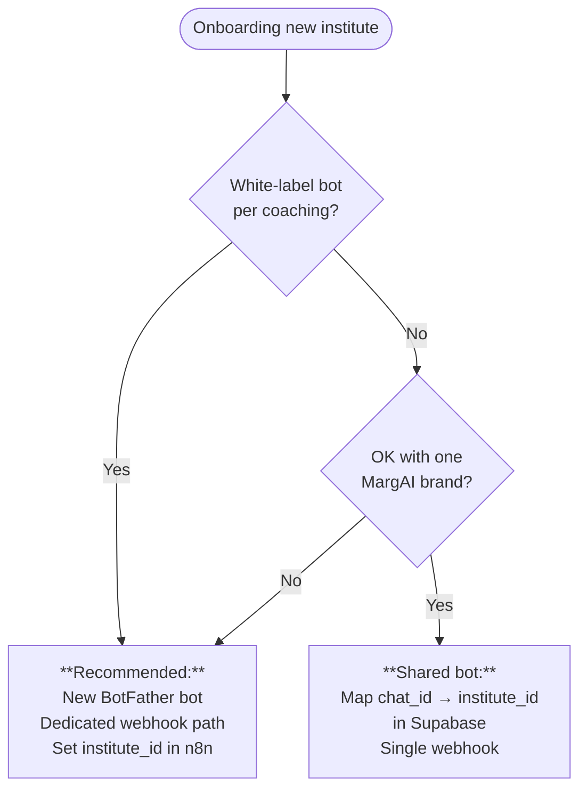

# Multi-institute onboarding (Ghost Tutor)

**Terminology:** “**Institute**” and “**tenant**” mean the same thing here (one coaching center / one Pinecone namespace).

How the pilot **isolates** data today, how to **onboard** many institutes, and what to change in **Telegram**, **n8n**, and **Supabase**. This is the **single canonical doc** for scaling beyond one center — architecture, checklists, and **pending code/workflow changes** (§ below) live here; there is no separate “multi-tenant” twin file.

**Related:** [PLAN.md](../PLAN.md) (pilot scope), [PINECONE_NAMESPACE.md](PINECONE_NAMESPACE.md), [PRODUCTION-DEPLOYMENT-PLAN.md](PRODUCTION-DEPLOYMENT-PLAN.md), [RUN.md](../RUN.md).

---

## Executive answers

| Question | Answer |
|----------|--------|
| **Will each institute get a different Telegram bot?** | **Recommended: yes** — one BotFather bot per institute (white-label branding; one webhook URL per bot). |
| **Will each institute need a different n8n workflow?** | **No** — keep **one** workflow. Vary only **how you set `institute_id`** and **which bot token** you use for replies (multiple webhooks → merge, or external router). |
| **How does isolation work?** | **Same Pinecone index**, **namespace = `str(institute_id)`** for both ingest and query. Supabase rows carry `institute_id`. Wrong `institute_id` in n8n is a **security bug** — audit all paths. |
| **Was this planned before?** | **Yes** — `PLAN.md` Step 4 called out multi-tenant mapping “later”; **this doc** is the concrete onboarding + architecture reference. |

---

## Architecture: data plane (all institutes)

Isolation does **not** require separate Pinecone indexes. Namespaces separate vectors; Supabase FKs separate logs and uploads.

---

## Architecture: control plane — recommended (**one bot per institute**)

Each Telegram bot has its **own** `getUpdates` / webhook. You map **which bot fired** → **`institute_id`** + **that bot’s token** for `sendMessage` / `getFile`.

**Implementation notes (n8n):**

1. Register **two webhooks** in the same workflow (different **path** suffixes), each wired to a **Set** node that assigns **`institute_id`** (and optionally stores **credential name** or **header** your router sends).
2. **Merge** (or use a single **IF/Switch** on `webhook path` / custom header) so **one** copy of: Supabase insert → embed → Pinecone → Gemini → reply.
3. **Telegram HTTP nodes** today often use `{{ $env.TELEGRAM_BOT_TOKEN }}`. For multi-bot, use **per-institute credentials** (n8n Telegram credential per bot) and select via expression, **or** store token in Supabase (encrypted) and use **HTTP Request** with `Authorization` / query param — **never** commit tokens to git.

---

## Alternative: **one shared bot** (single @MargAIBot)

Use when branding is centralized and students **bind** an institute once (e.g. `/start visionias`).

**Tradeoffs:** one token, one webhook — simpler ops; weaker per-institute branding; must handle **unmapped** `chat_id` (prompt `/start` with slug).

---

## Decision: which model to use?

---

## How it works today (single-institute pilot)

| Layer | Behavior |
|--------|----------|
| **Pinecone** | One **shared index** (`margai-ghost-tutor-v2`). Vectors scoped by **namespace = `str(institute_id)`**. |
| **Ingest** | `scripts/ingest_pdf.py <pdf> <institute_slug>` resolves `institute_id` from `institutes.slug` and upserts into that namespace. |
| **n8n** | **`Set institute_id and parse`** sets **`institute_id` = `1` (hardcoded)** in `n8n-workflows/v6.json`. Pinecone uses `pineconeNamespace: ={{ String($json.institute_id) }}`. |
| **Telegram** | One **bot token** (e.g. env `TELEGRAM_BOT_TOKEN`) for `sendMessage` / `getFile`. |
| **Supabase** | `query_logs.institute_id`, `uploads.institute_id` — multi-tenant at schema level. |

**Data isolation is correct in Pinecone + DB** when `institute_id` is correct; **routing** is still **single-tenant** in the exported workflow until you add branches or lookup.

---

## What stays the same vs what changes

| Component | Shared across institutes? | Per institute? |
|-----------|---------------------------|----------------|
| **Pinecone index** | ✅ Same index | ❌ (namespaces, not indexes) |
| **Namespace** | ❌ | ✅ `str(institute_id)` |
| **n8n RAG logic** | ✅ One workflow | ❌ (duplicate only if you choose ops isolation — not recommended) |
| **Gemini / Pinecone API keys** | ✅ Usually one account | ❌ |
| **Telegram bot** | Optional (shared-bot model) | ✅ **Recommended:** one bot each |
| **Webhook URL** | Shared-bot: one URL | Multi-bot: **different path or different workflow URL** per bot |
| **Ingest script** | ✅ Same code | Run per **`institute_slug`** |

---

## Onboarding checklist (per new institute)

1. **Supabase** — Insert `institutes` row: `slug`, `email_for_report`, `ta_telegram_id`; note new **`id`** for Pinecone namespace.
2. **Telegram** — Create bot with BotFather; `setWebhook` to the URL/path that maps to this institute.
3. **n8n** — Add **Webhook + Set `institute_id`** branch (or Supabase lookup); wire **Telegram** actions to **this** bot’s credential/token.
4. **Pinecone** — No new index; confirm query uses `namespace = String(institute_id)`.
5. **Ingest** — `python scripts/ingest_pdf.py <file.pdf> <institute_slug>` for their PDFs.
6. **RLS / reporting** — Replace pilot policies like `institute_id = 1` with **per-tenant** rules where needed; run `weekly_report.py` **per** `institute_id` or slug.

---

## Hardening before scaling

- **Stop auto-creating institutes** in `ingest_pdf.py` for production (admin-only provisioning).
- **Audit** every n8n path that sets `institute_id` — no silent default `1` in prod.
- **Secrets:** never log bot tokens; restrict token columns to service role / Edge Functions.
- **Optional schema:** `telegram_bots` (`institute_id`, `bot_username`, encrypted `token`, `webhook_path_suffix`) as source of truth for operators.

---

## Implementation backlog (remove hardcoded `institute_id`) — **not shipped yet**

*Aligned with § above; kept in one place so we don’t maintain two docs. Implement only after you explicitly approve.*

### Goals

1. Stop routing **all** Telegram traffic to **`institute_id = 1`** in n8n (today: **Set** node in `v6.json` / `telegram-webhook.json`).
2. Avoid **silent wrong-tenant** ops (reports defaulting to 1, audit default namespace, ingest auto-creating institutes).

### A) n8n (required for real multi-tenant)

- **Pattern A (recommended):** second **Webhook** per bot → **Set** numeric `institute_id` → **Merge** into shared RAG; **Telegram credential per bot** (or token lookup).
- **Pattern B (one bot):** migration **`002_telegram_chat_institute_map.sql`** — table `telegram_chat_id` → `institute_id`; `/start <slug>` to bind; main flow **lookup** before `query_logs` + Pinecone.
- **Deliverable:** updated `n8n-workflows/v6.json` + correct `setWebhook` URLs.

### B) Supabase

- Run **002** migration if Pattern B; later replace pilot RLS `institute_id = 1` when anon/auth needs real isolation.

### C) Python scripts (**if approved** — breaks current CLI defaults)

| Script | Change |
|--------|--------|
| `ingest_pdf.py` | `--require-existing-institute` — fail if slug missing (no auto-create). |
| `weekly_report.py` | `--institute-id` **required** (no default `1`). |
| `pinecone_retrieval_audit.py` | **`--namespace` or `INSTITUTE_ID` env** required; no silent default `"1"`. |

### Approval checklist

- [ ] Pattern **A**, **B**, or hybrid  
- [ ] OK with script CLI changes  
- [ ] OK with SQL migration (B only)  

---

## Related docs

| Doc | Role |
|-----|------|
| [EXPLORATION.md](../EXPLORATION.md) | Full stack narrative (flows, §5.1 multi-tenancy, n8n/prompt limits) — aligned with current `lib/` + workflows |
| [PLAN.md](../PLAN.md) | 14-day pilot tasks; **§ Multi-institute (post-pilot)** links here |
| [PINECONE_NAMESPACE.md](PINECONE_NAMESPACE.md) | Namespace = `institute_id` |
| [PRODUCTION-DEPLOYMENT-PLAN.md](PRODUCTION-DEPLOYMENT-PLAN.md) | Deploy gates; **multi-tenant** subsection |
| [RUN.md](../RUN.md) | Ingest commands per slug |

---

## Summary table

| Question | Answer |
|----------|--------|
| Different Telegram bots? | **Recommended: yes** |
| Different n8n workflows? | **No** — one workflow; multiple webhooks or router; dynamic `institute_id` + token |
| Different Pinecone index? | **No** — same index, **different namespaces** |
| Canonical plan doc | **This file** (`docs/MULTI-INSTITUTE-ONBOARDING.md`) |
